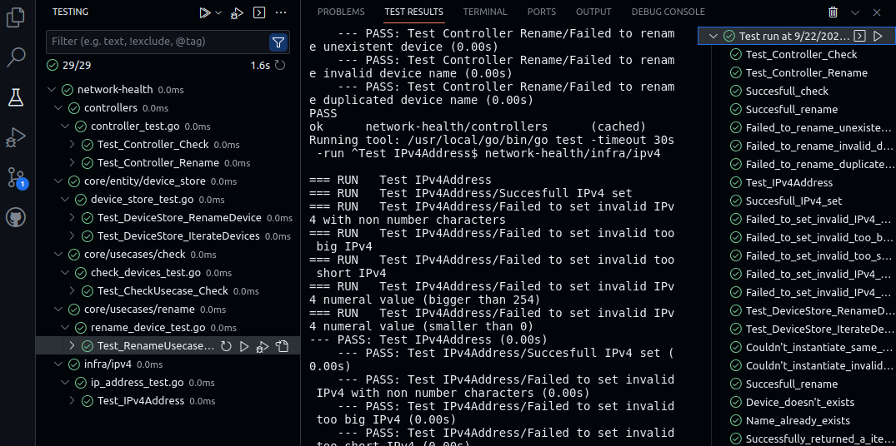

# network-health

network-health is an API that checks the availability of devices given the
subnet where it was deployed. It can be used to validate if registered microcontrollers
are all online, for example.

The supported status for devices are:

- `Loaded` - If the API successfully registered the device, but it couldn't be reached
- `Online` - If the API successfully registered and reached the device
- `Offline` - If the API successfully registered the devices, but it couldn't connect to [`ConnectionHandler`](core/entity/connectivity/connectivity_handler.go) server

Observations:

- Each API instance can track specific address set at the start of the application
- Each device is given a random name. But there is an endpoint to update for better readability

## Deploy options

### Docker

``` bash
docker-compose build
docker run -p 8081:8080 lo-han/network-health --address=127.0.0.1 --address=192.168.1.10 --address=...
```

## Infrastructure options

### Connection handler

- [ICMP](infra/icmp/icmp_connectivity.go)

### Presenter

- [HTTP](infra/web/routes/routes.go)

### Logs

- [Stdout](infra/stdout/stdout.go)

### Network addresses

- [IPv4](infra/ipv4/ip_address.go)

## Endpoints

### /v1/network/devices/health [GET]

#### Response codes

- `Ok (200)`

#### Response example
``` json
{
    "code": "NETSTAT_200",
    "content": {
        "Datetime": "2023-09-22T18:08:06.227310509-03:00",
        "Devices": [
            {
                "Address": "192.168.1.10",
                "Name": "patient-wind",
                "Status": "OFFLINE"
            },
            {
                "Address": "127.0.0.1",
                "Name": "twilight-wave",
                "Status": "ONLINE"
            }
        ]
    }
}
```

### /v1/network/devices/rename/:name [PATCH]

#### Response codes

- `No Content (204)`
- `Bad request (400)`
- `Not found (404)`

#### Request example
``` json
{
    "new_name": "my_device"
}
```

#### Error response example

``` json
{
    "code": "NETSTAT_404",
    "content": {
        "error": "Failed to rename 'twilight-wave' device: Device not found"
    }
}
```

### /v1/network/health [GET]

#### Response codes

- `Ok (200)`

#### Response example
``` json
{
    "status": "ok"
}
```

## Tests



